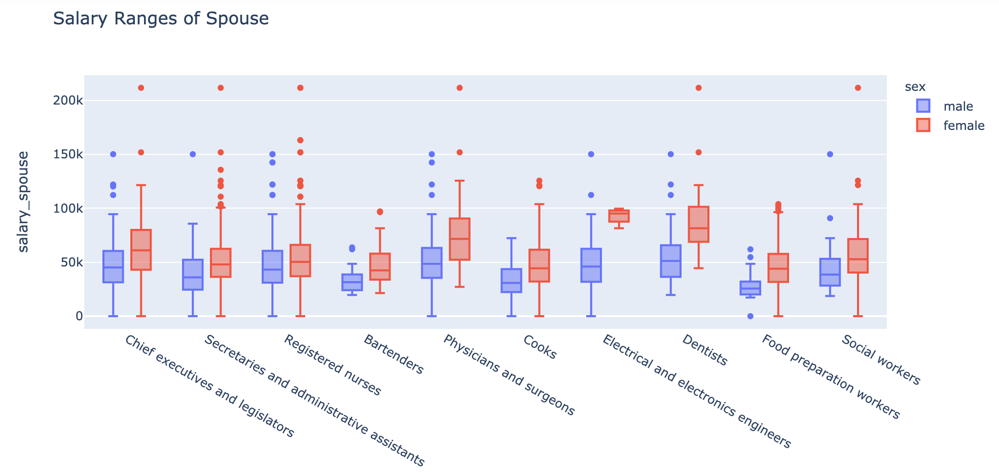
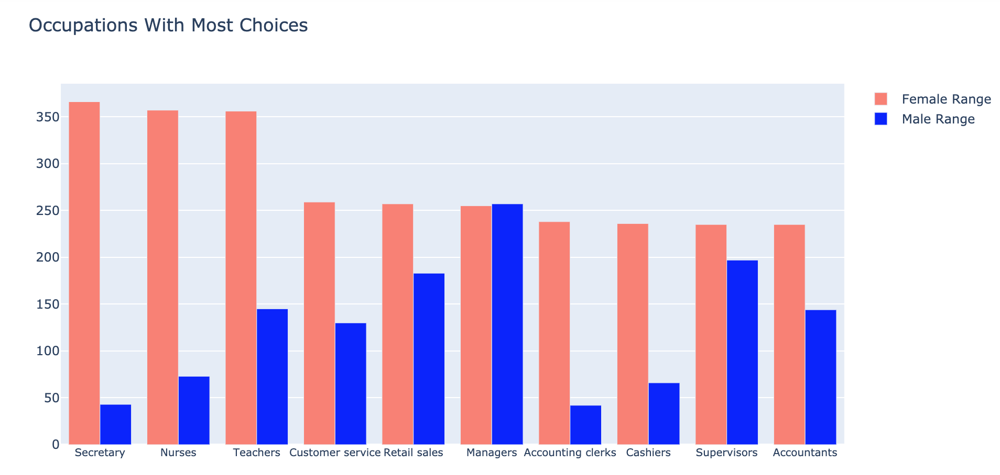
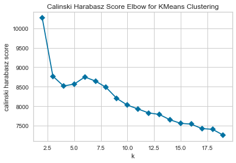
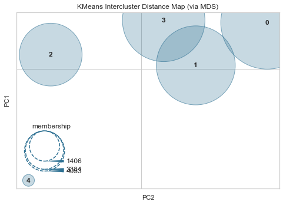
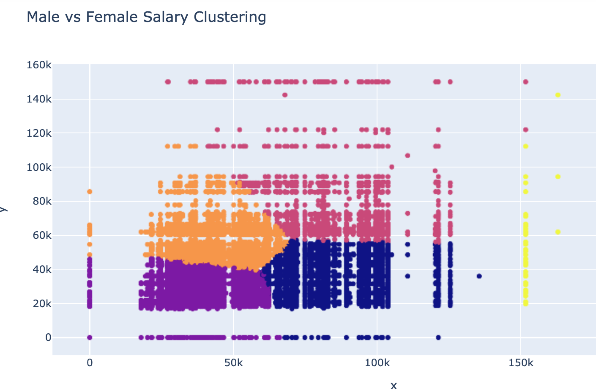

# marital-occupation

Goals: 
- Conduct a broad analysis on the trends in occupations that get married
- Investigate which occupations and genders have the most choices of other occupations to marry
- Investigate which occupations and genders have the most upward economic mobility (ability to marry outside one's salary range)
- Implement a clustering algorithm to group similar couples and occupations together

Data:
- U.S. Census Bureau American Community Survey (ACS) 2014
  - Totaled males and females by occupations individually (i.e. 3,837 male elementary teachers, 24,930 female elementary teachers)
  - Totaled unique couples by occupation (i.e. 1,157 total couples containing a male truck driver and a female secretary)
  - Calculated percentages of male and females per occupation based on total males or females per occupation (7% of female elementary teachers marry 45% of male elementary teachers)
- U.S. Census Bureau Salary Data
  - Merged salary data for both males and females for both partners of each marital couple (Male physician/surgeon salary: $211,526 vs Female physician/surgeon salary: $150,053)
  - Calculated the absolute difference between the salaries of each partner of each marital couple to determine income inequality per couple
  

  
  
Models:
- K-Nearest Neighbors Classifier - given an amount of neighbors, shows the closest match for a given couple
- K Means Clustering - Divided dataset into 5 different groups using Calinski Harabasz Elbow Score

